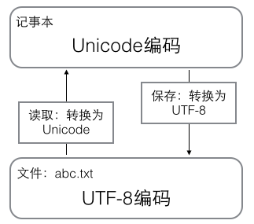

- 数据类型：整数，浮点数，字符串，布尔值，空值
- 字符编码：计算机只能处理数字，如果要处理文本，就必须先把文本转换为数字才能处理。
	- Unicode字符集：Unicode把所有语言都统一到一套编码里，这样就不会再有乱码问题了。
		- ASCII编码是1个字节，而Unicode编码通常是2个字节。
		- UTF-8编码：本着节约的精神，又出现了把Unicode编码转化为“可变长编码”的`UTF-8`编码。
			- UTF-8编码把一个Unicode字符根据不同的数字大小编码成1-6个字节。
			- 用记事本编辑的时候，从文件读取的UTF-8字符被转换为Unicode字符到内存里，编辑完成后，保存的时候再把Unicode转换为UTF-8保存到文件：
				- 
				-
		-