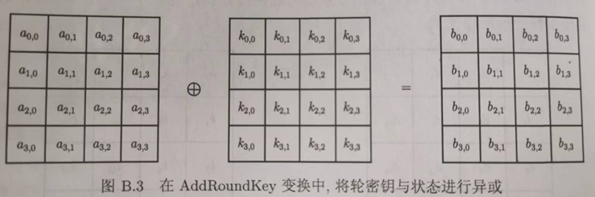
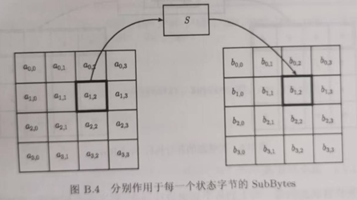
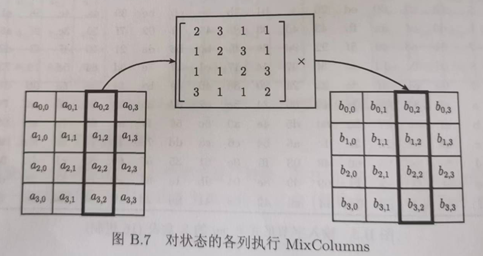
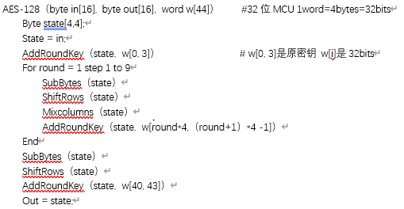

- 轮密钥加（[[AddRoundKey]]）轮密钥与当前状态异或
	- 
- 字节替换（[[SubBytes]]）对当前状态的非线性变换，又称S盒
	- $S(x)= A*X^{-1}+b$
	- 
- 行移位变换（[[ShiftRows]]）每行按不同位移量进行循环移位
	- 
- 混合列变换（[[Mixcolumns]]）每列与一个固定矩阵相乘
	- 
- 伪代码：
	- 
	-
	-